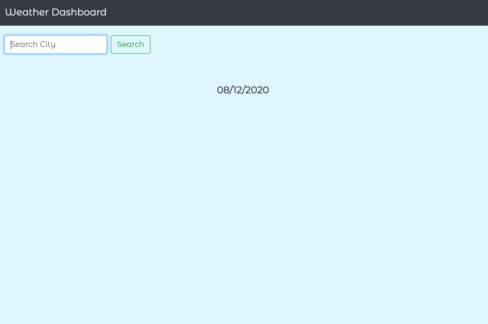
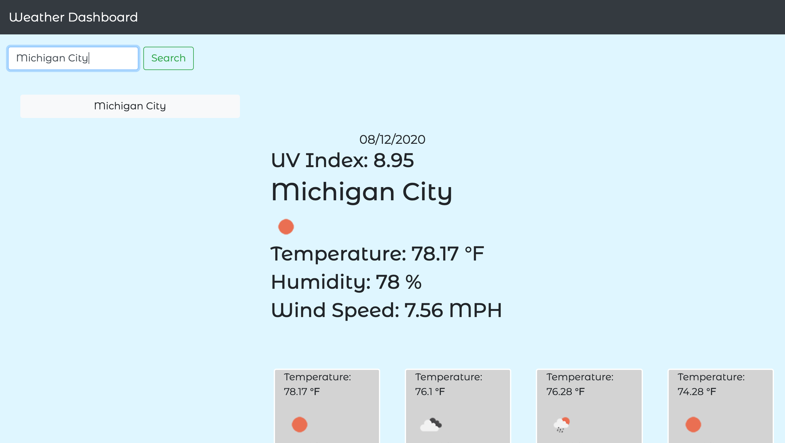

# Weather Dashboard
By Angel Alexander

Resources used:
- [OpenWeather API](https://openweathermap.org/api) 
- [jQuery] (https://jquery.com/)
- [Moment.js] (https://momentjs.com/)

## User Story

```
AS A traveler
I WANT to see the weather outlook for multiple cities
SO THAT I can plan a trip accordingly
```

## App functionality

```
When I enter a city in the searchbar, I am presented with current weather for that day and for the next five days. The cities are saved in local storage and are clickable to see the weather information.
```

## Screenshots


